# EXPERIMENT 3-FEATURE ENCODING AND TRANSFORMATION

### NAME:VENKATANATHAN P R
### REG NO:212223240173
### DATE:29-09-2024

## AIM:
To read the given data and perform Feature Encoding and Transformation process and save the data to a file.

## ALGORITHM:
STEP 1:Read the given Data.
STEP 2:Clean the Data Set using Data Cleaning Process.
STEP 3:Apply Feature Encoding for the feature in the data set.
STEP 4:Apply Feature Transformation for the feature in the data set.
STEP 5:Save the data to the file.

## FEATURE ENCODING:
1. Ordinal Encoding
An ordinal encoding involves mapping each unique label to an integer value. This type of encoding is really only appropriate if there is a known relationship between the categories. This relationship does exist for some of the variables in our dataset, and ideally, this should be harnessed when preparing the data.
2. Label Encoding
Label encoding is a simple and straight forward approach. This converts each value in a categorical column into a numerical value. Each value in a categorical column is called Label.
3. Binary Encoding
Binary encoding converts a category into binary digits. Each binary digit creates one feature column. If there are n unique categories, then binary encoding results in the only log(base 2)ⁿ features.
4. One Hot Encoding
We use this categorical data encoding technique when the features are nominal(do not have any order). In one hot encoding, for each level of a categorical feature, we create a new variable. Each category is mapped with a binary variable containing either 0 or 1. Here, 0 represents the absence, and 1 represents the presence of that category.

## Methods Used for Data Transformation:
  # 1. FUNCTION TRANSFORMATION
• Log Transformation
• Reciprocal Transformation
• Square Root Transformation
• Square Transformation
  # 2. POWER TRANSFORMATION
• Boxcox method
• Yeojohnson method

## CODING AND OUTPUT:

### IMPORT THE PANDAS LIBRARY AND READ THE CSV FILE:
```PYTHON
import pandas as pd
df=pd.read_csv("Encoding Data.csv")
df
```
### OUTPUT:
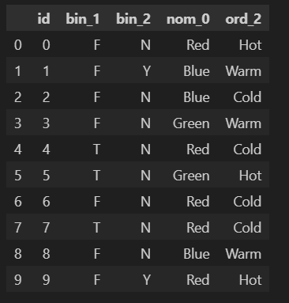

## PERFORMING THE ORDINAL ENCODER:
```PYTHON
from sklearn.preprocessing import LabelEncoder,OrdinalEncoder
```

### TRANSOFORMING THE CATEGORICAL DATA INTO ORDINAL FORM:
```PYTHON
pm=['Hot','Warm','Cold']

el=OrdinalEncoder(categories=[pm])

el.fit_transform(df[["ord_2"]])
```
### OUTPUT:

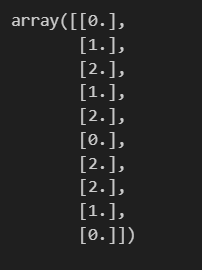

### TRANSFORMS THE COLUMN:
```PYTHON
df['bo2']=el.fit_transform(df[["ord_2"]])

df
```
### OUTPUT:

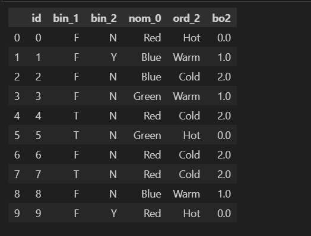

### CHANGE THE CATEGORICAL INTO NUMERICAL COLUN:
```PYTHON
df['ord_2']=el.fit_transform(df[["ord_2"]])

df
```
### OUTPUT:
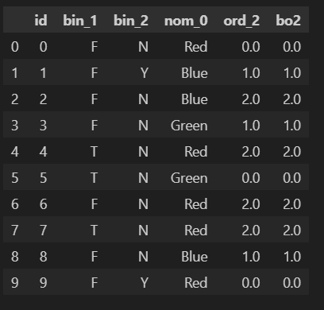

## PERFORMING THE ONEHOTENCODER:
```PYTHON
from sklearn.preprocessing import OneHotEncoder
```
```PYTHON
ohe=OneHotEncoder(sparse=False)
df2=df.copy()

df2
```
### OUTPUT:
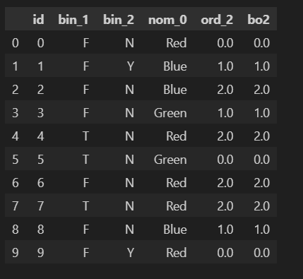

```PYTHON
enc=pd.DataFrame(ohe.fit_transform(df2[["nom_0"]]))
enc
```

### OUTPUT:
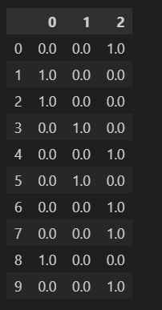

### ADDING THE ONEHOTENCODER DATA TRANSFORMED INTO THE ORIGINAL DATASET:
```PYTHON
df2=pd.concat([df2,enc],axis=1)

df2
```
### OUTPUT:
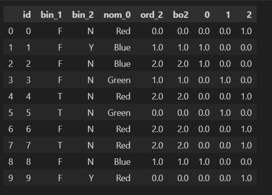

### KNOW THE PRESENCE AN ABSENCE OF DATA VALUES:
```PYTHON
pd.get_dummies(df2,columns=["nom_0"])
```
### OUTPUT:
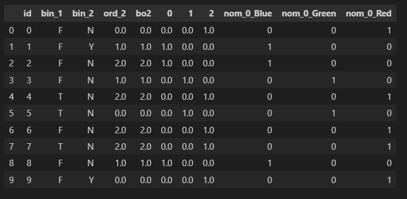

### INSTALLED THE CATEGORY ENCODERS:
```PYTHON
pip install --upgrade category_encoders
```

### IMPORT BINARY ENCODER FROM CATEGORY ENCODERS:
```PYTHON
from category_encoders import BinaryEncoder
```
### READ THE CSV FILE:
```PYTHON
df=pd.read_csv("data.csv")

df
```
### OUTPUT:
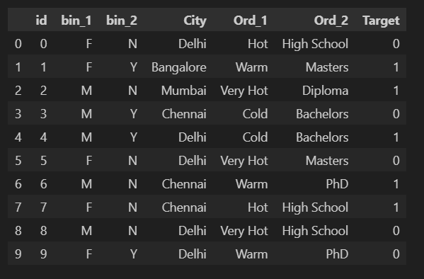

### TRANSFORMING THE CATEGORICAL DATA INTO BINARY ENCODER:
```PYTHON
be=BinaryEncoder()

nd=be.fit_transform(df['Ord_2'])

dfb=pd.concat([df,nd],axis=1)

dfb1=dfb.copy()

dfb1
```
### OUTPUT:
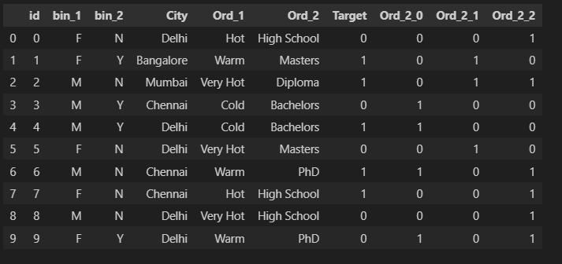

### IMPORT THE TARGET ENCODER FROM CATEGORY ENCODERS
```PYTHON
from category_encoders import TargetEncoder
te=TargetEncoder()
cc=df.copy()
new=te.fit_transform(X=cc["City"],y=cc["Target"])
cc=pd.concat([cc,new],axis=1)
cc
```
### OUTPUT:
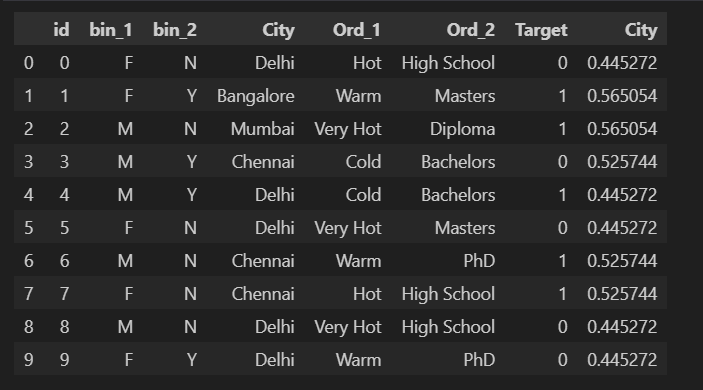

### IMPORT PANDAS, SCIPY AND NUMPY TO PERFORM FEATURE TRANFORMATION:
```PYTHON
import pandas as pd
from scipy import stats
import numpy as np
```
### READ THE CSV FILE:
```PYTHON
df=pd.read_csv("Data_to_Transform.csv")
df
```
### OUTPUT:
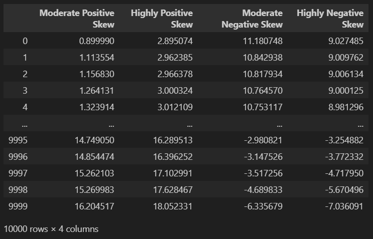

### FIND THE SKEWNESS OF THE DATASETS:
```PYTHON
df.skew()
```
### OUTPUT:
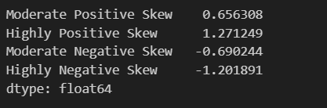

## PERFORMING MATHEMATICAL OPERATIONS FOR THE GIVEN DATASET TO FIND THE SKEWNESS:
### LOGARITHM:
```PYTHON
np.log(df["Highly Positive Skew"])
```
### OUTPUT:
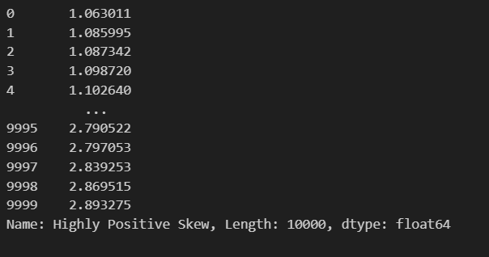

### SQUARE ROOT:
```PYTHON
df["Highly Positive Skew"]=np.sqrt(df["Highly Positive Skew"])
df
```
### OUTPUT:
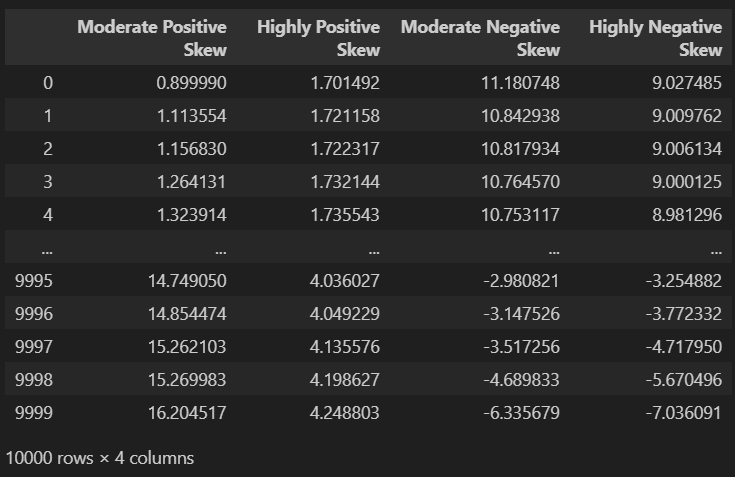

### SQUARE: 
```PYTHON
df["Moderate Negative Skew"]=np.square(df["Moderate Negative Skew"])
df
```
### OUTPUT:
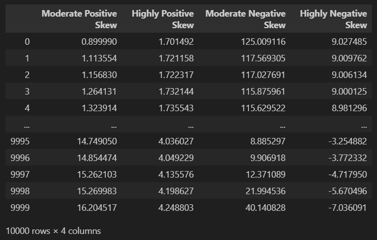

### SQUARE ROOT:
```PYTHON
np.sqrt(df["Highly Negative Skew"])
```
### OUTPUT:
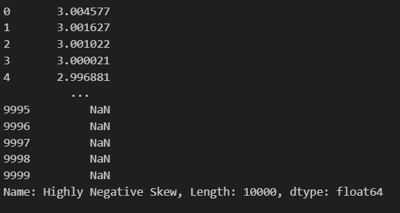

### FIND THE SKEWNESS:
```PYTHON
df.skew()
```
### OUTPUT:
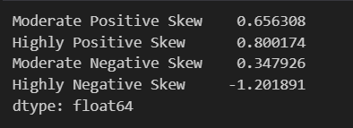

## TRANSFORMS NON-NORMAL DATA INTO A NORMAL DISTRIBUTION:(ONLY POSITIVE VALUE)
### BOXCOX TRANFORMATION:
```PYTHON
df['Highly Positive Skew_boxcox'],parameters=stats.boxcox(df['Highly Positive Skew'])
df
```
### OUTPUT:
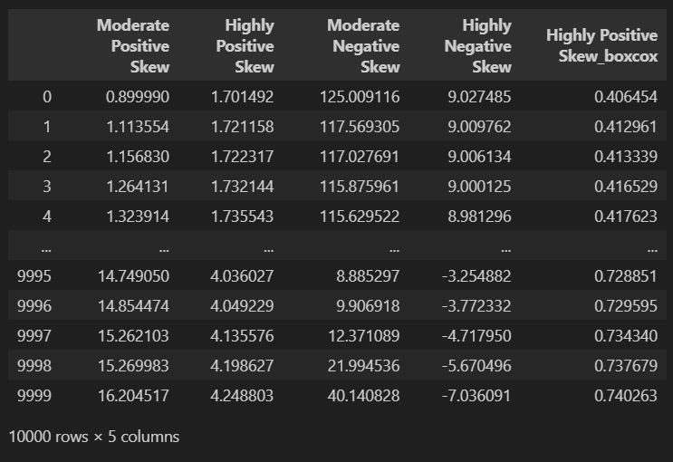

## TRANSFORMS NON-NORMAL DATA INTO A NORMAL DISTRIBUTION:(BOTH NEGATIVE AND POSTIVE VALUES):
### YEO JOHNSON TRANSFORMATION:
```PYTHON
df["Moderate Negative Skew_YEOJOHNSON"],parameters=stats.yeojohnson(df["Moderate Negative Skew"])
df
```
### OUTPUT:


### FIND THE SKEWNESS:
```PYTHON
df.skew()
```
### OUTPUT:
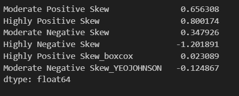

### ANALYSING THE DATA IN THE VISUALIZATION WAY:
```PYTHON
import seaborn as sns
import statsmodels.api as sm
import matplotlib.pyplot as plt


sm.qqplot(df['Moderate Negative Skew'],line='45')
plt.show()
```
### OUTPUT:
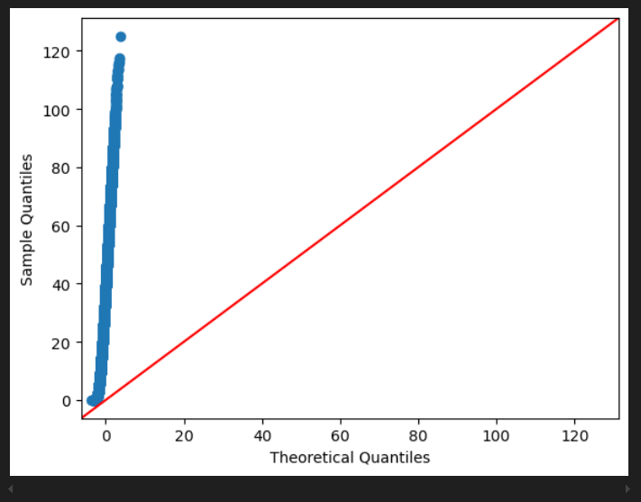

### VISUALISE THE DATA INTO THE RECIPROCAL FORM:
```PYTHON
sm.qqplot(np.reciprocal(df['Moderate Negative Skew']),line='45')
plt.show()
```
### OUTPUT:
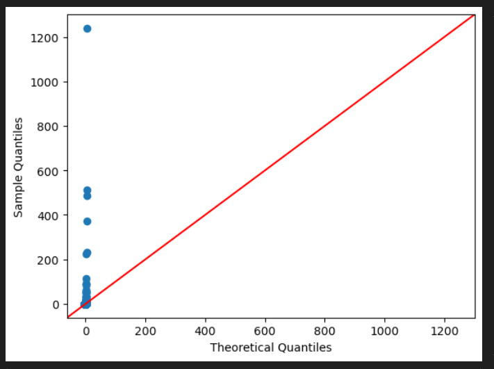

### PERFORMS QUANTILE TRANSFORMER(Dataset into a uniform or normal data distribution):
```PYTHON
from sklearn.preprocessing import QuantileTransformer

qt=QuantileTransformer(output_distribution='normal')

df["Moderate Negative Skew_1"] = qt.fit_transform(df["Moderate Negative Skew"].values.reshape(-1, 1))
```
### OUTPUT:
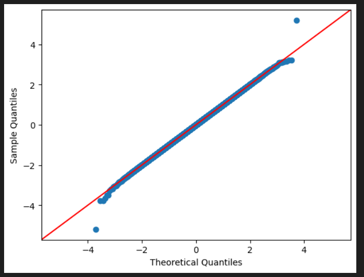

### CHECK WHETHER IT IS NORMALIZED FORM:
```PYTHON
sm.qqplot(df['Moderate Negative Skew_1'],line='45')
plt.show()
```
### OUTPUT:


### PERFORMS QUANTITLE TRANFORMER:
```PYTHON
df["Highly Negative Skew_1"]=qt.fit_transform(df[["Highly Negative Skew"]])
sm.qqplot(df['Highly Negative Skew'],line='45')
plt.show()
```
### OUTPUT:
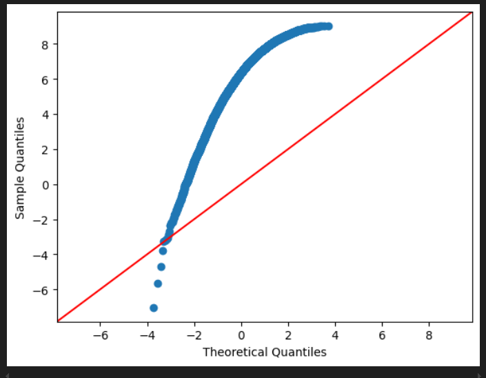

### CHECK WHETHER IT IS NORMALIZED FORM:
```PYTHON
sm.qqplot(df['Highly Negative Skew_1'],line='45')
plt.show()
```
### OUTPUT:
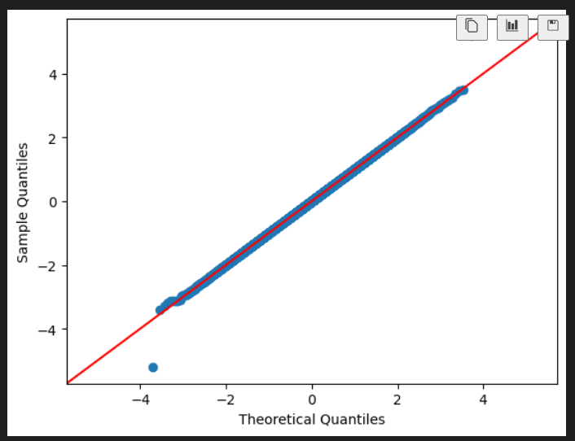

### DISPLAY THE FINALIZED DATASET FOR THE TRANSFOMRED DATASET:
```PYTHON
df
```
### OUTPUT:


## RESULT:

Thus the given data, Feature Encoding, Transformation process and save the data to a file was performed successfully.
       

       
